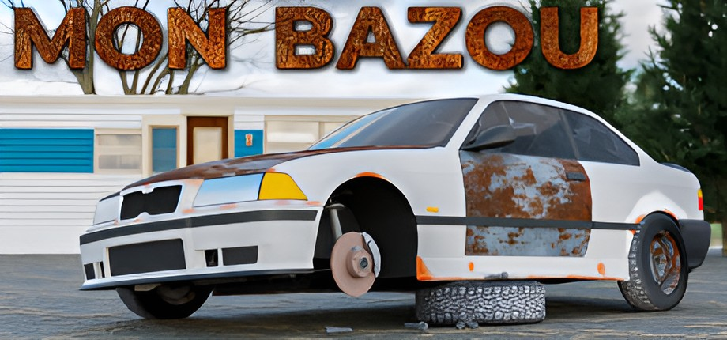

<h1 align="center">Mon Bazou // Multiplayer Mod</h1>

<p align="center">
  
</p>

This is a multiplayer mod for the game [Mon Bazou](https://store.steampowered.com/app/1520370/Mon_Bazou/), that uses Steam networking.

# Installation

**To use this mod (or to contribute to the project), you must own the game on Steam.** This mod uses Steam networking to make and manage lobbies, therefore you cannot use a cracked version.

## Installation video

## Installation steps

1. Install MelonLoader [from their site](https://melon-loader.com/) or [GitHub (releases)](https://github.com/LavaGang/MelonLoader/releases/), and mod the game
2. Download the mod from the [releases tab](https://github.com/antalervin19/MonMulti/releases/)
3. Copy the mod into the game's `mods` folder (the game's folder can be opened by locating the game in your Steam library, then clicking `Settings > Manage > Browse local files`)
4. Launch the game. If you succeeded, there should be a notification telling you the mod loaded correctly.

# Roadmap

This mod is still under development. As such, some features you expect might not be present yet.

✅ =  completed | 🟧 = feature is in development | ⬛ = development has not yet started.

* ✅ Basic Lobby Creation & Joining to other Hosts
* ✅ Player Movement & Client Synchronization
* 🟧 Cash & Weather & Time Synchronization (Weather is a bit tricky)
* 🟧 Vehicle Ownerships & Movement Synchronization
* ⬛ NPC Vehicle & NPC character Synchronization
* ⬛ Friend-Ship Synchronization
* ⬛ Movable Item Synchronization (For e.g: Screws, Poutine, CarParts)

# Building and Contributing

These are the steps required if you want to build the project for yourself, or if you want to contribute. **This is NOT required if you just want to play**.

## Prerequisites

You must have **Visual Studio 2022** or **Visual Studio 2026** installed, and you must mod the game using MelonLoader. (Follow the [installation steps or the video](#installation) to mod the game).

## Building from Source

After you modded the game using MelonLoader, follow these steps if you want to build the project.

1. Clone the repository and open the solution (`MonMulti.slnx`)

2. Open the (`Directory.Build.props`) file and edit the GamePath Property to match your installation!
   
This file will tell MSBuild where your local game installation is located, allowing the linker to reference the game's assemblies correctly.

4. Edit the following file to include your game path like the example below. To get this path, locate the game in your Steam library, then click `Settings > Manage > Browse local files`

   ```xml
   <Project>
     <PropertyGroup>
       <GamePath>C:\Program Files (x86)\Steam\steamapps\common\Mon Bazou</GamePath>
     </PropertyGroup>
   </Project>
   ```

   The path must be the location of your game install (where the `.exe` is located), not the `mods` directory.

5. Build the project by pressing `CTRL + B` or by going to `Build > Build MonMulti` (or `Build > Build Solution`)

6. Check if MSBuild successfully copied the mod into the game's `mods` directory, then start the game to test it.

## Contributing

<!-- Before contributing, please read the [contribution guidelines](CONTRIBUTING.md). -->

All contributions on the project are welcome. You can contribute to the code, report bugs or suggest features.

**If you like the project but don't have time to make a contribution directly, that's fine! There are other ways to show your appreciation, for example by sharing it with friends or talking about it on social media.**

### Licensing and copyright

By submitting a Pull Request to this repository, you agree that your contributions will be licensed under the project's current [GNU GPLv3 License](LICENSE).

### Reporting bugs

Please report bugs through the [Issues](https://github.com/antalervin19/MonMultiP/issues) tab. Before submitting, please check the existing issues to see if they are already reported. If not, open a new issue and include the following details:

* A clear title summarizing the problem
* Steps to reproduce the issue
* Details of your environment (ex.: Your OS, game version)
* Screenshots or error logs (if applicable)

### Submitting a Pull Request

If you are ready to contribute to the project by writing and submitting code:

* Fork the repository, and create your own branch from the `main` branch
* Make your changes **(Make sure they are small and focused on a single task)**
* Test out the changes
* Submit a Pull Request to our `main` branch, with a clear description of the changes you did

After submitting your PR, a maintainer will review your code, request changes when it's ready, and merge it when it's ready.

### Again, thank you for contributing to the project!

# Notes

Thanks to [cablesalty](https://github.com/cablesalty) for the ReadME 😂!
